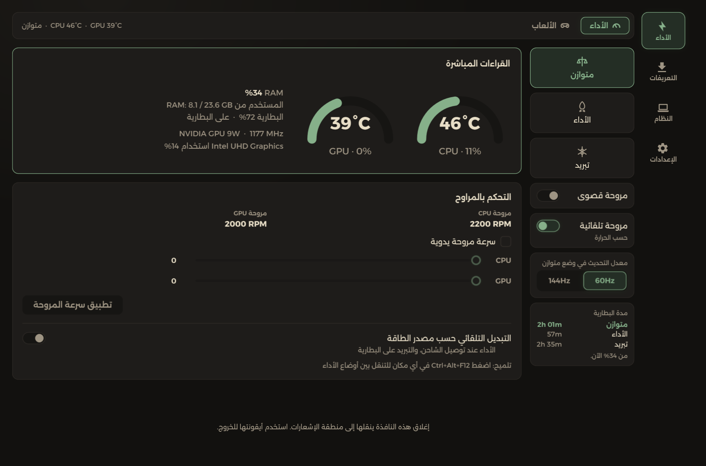
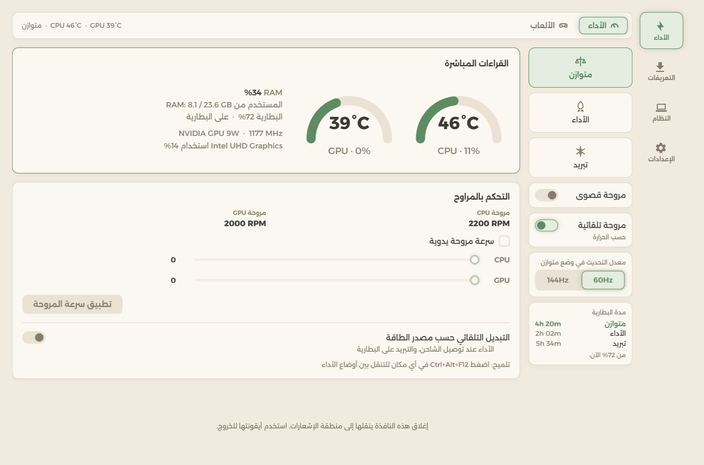
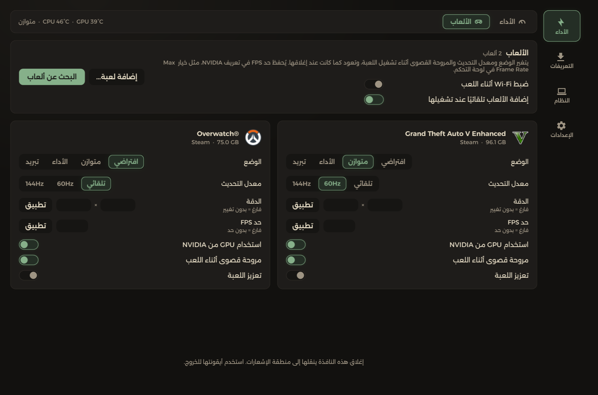
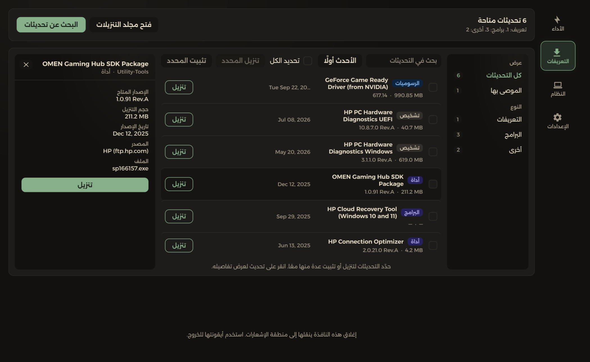
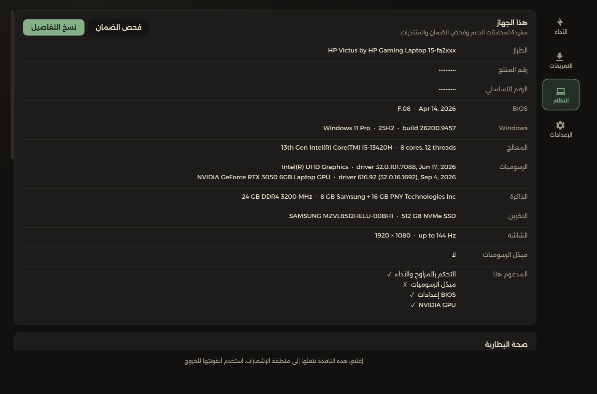
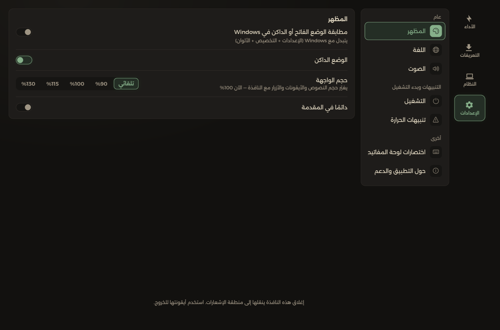
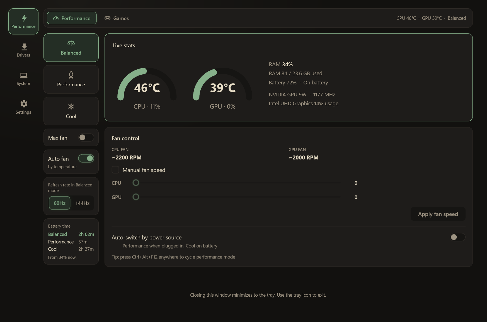

<div dir="rtl">

# Victus Hub

[English](README.md) · **العربية**

Victus Hub (سابقًا HP Victus Control) بديل خفيف وسريع لأجزاء التحكم بالمراوح والأداء في Omen Gaming Hub، صُمّم لجهاز HP Victus 15،
ويُفترض أن يعمل أيضًا على أجهزة Omen التي تستخدم واجهة BIOS نفسها.

يتواصل البرنامج مباشرةً مع مزوّد WMI الخاص بالـ BIOS (`root\wmi`، الفئة `hpqBIntM`)، وهو نفسه
الذي تستخدمه برامج HP. لا يستخدم تعريف نواة (kernel driver) ولا خدمة في الخلفية ولا يرسل أي
بيانات. هو فقط تطبيق WPF مع أيقونة في منطقة الإشعارات يقرأ من الـ BIOS كل ثانيتين.

**[تحميل آخر إصدار](https://github.com/9vsv6/victus-hub/releases/latest)**



## لقطات الشاشة

| | |
|---|---|
|  |  |
| **الأداء** في الوضع الفاتح | **الألعاب**: إعدادات خاصة لكل لعبة |
|  |  |
| **التعريفات**: تحديثات من HP وNVIDIA وIntel | **النظام**: معلومات الجهاز وما يدعمه هذا الطراز |
|  |  |
| **الإعدادات** | الواجهة **الإنجليزية** |

## المزايا

- عرض مباشر لدرجة الحرارة وسرعة المراوح (في تلميح أيقونة الإشعارات وفي النافذة الرئيسية)
- سرعة يدوية لكل مروحة (بأفضل جهد، انظر الملاحظة أدناه)
- تشغيل المراوح بأقصى سرعة
- طاقة كرت الشاشة: حد طاقة أعلى (custom TGP) وDynamic Boost لكرت NVIDIA، إذا كان الـ BIOS يدعمهما
- وضع التبريد عند الخمول: تهدأ المراوح بعد دقائق من عدم الاستخدام وتعود فور رجوعك. لا يغيّر الوضع
  المختار ولا خطة الطاقة ولا السطوع، ولا يعمل أثناء تشغيل لعبة من قائمتك
- مفتاح لإضاءة لوحة المفاتيح، مع خيار إطفائها تلقائيًا أثناء خمول الجهاز
- التبديل بين أوضاع الأداء: متوازن / أداء / تبريد، مع مدة البطارية المتوقعة لكل وضع من الشحن
  الحالي. تُحسب المدة من الاستهلاك الفعلي لكل وضع أثناء العمل على البطارية
- إعدادات لكل لعبة: وضع الأداء، معدل التحديث، الدقة، حد الإطارات (FPS)، المروحة القصوى، تعزيز
  اللعب (أولوية المعالج وإيقاف OneDrive مؤقتًا) واختيار كرت الشاشة الذي تعمل عليه اللعبة. تُطبَّق
  عند تشغيل اللعبة وتعود كما كانت عند إغلاقها. ويمكن أيضًا ضبط الـ Wi-Fi (إيقاف البحث في الخلفية)
  أثناء اللعب
- تُضاف الألعاب إلى القائمة تلقائيًا عند تشغيلها أول مرة، من مكتبات Steam وEpic وXbox وGOG
  وBattle.net، دون تفعيل أي شيء حتى تختاره بنفسك
- اختصارات لوحة مفاتيح قابلة للتخصيص للمروحة القصوى وللتنقل بين أوضاع الأداء
- مزامنة خطة الطاقة في Windows مع الوضع المختار
- تحديثات التعريفات والـ BIOS من HP وNVIDIA وIntel:
  - تصفية حسب النوع، وبحث، وترتيب، ولوحة تفاصيل لكل تحديث (الإصدار المعروض مقابل المثبّت،
    والحجم، والمصدر).
  - إخفاء التحديثات الخاصة بقطع غير موجودة في جهازك، مثل بطاقات الشبكة اللاسلكية من إصدارات
    أخرى من الجهاز، وتحديثات SSD لأقراص غير مركّبة أو تعمل بالإصدار نفسه أصلًا.
  - فحص البطارية والشاحن قبل تثبيت الـ BIOS.
  - حذف ملفات التثبيت المحمّلة تلقائيًا.
- صفحة النظام: معلومات الجهاز، صحة البطارية، صحة القرص (حرارة الـ SSD والعمر المتبقي للكتابة)،
  مبدّل الرسوميات في الـ BIOS (إن وُجد في الطراز)، اختبار المراوح، وتنظيف ذاكرة الـ Shader
- إعدادات الـ BIOS دون الدخول إليه: حماية البطارية، تشغيل المراوح دائمًا، وضع مفاتيح الوظائف،
  مهلة قائمة الإقلاع، وزر إعادة التشغيل إلى الـ BIOS
- يتحقق من إصدارات GitHub مرة يوميًا، ويمكنه تحميل الإصدار الأحدث وتثبيته في مكانه بعد مطابقته
  مع checksum الإصدار (SHA256)
- يثبّت نفسه: يعرض نسخ نفسه إلى Program Files مع اختصار في قائمة ابدأ وإدخال في قائمة التطبيقات
  المثبّتة في Windows. وعند إلغاء التثبيت من هناك تعود المراوح وخطة الطاقة إلى الوضع الافتراضي
- يسجّل الأعطال في `%APPDATA%\HP Victus Control\crash.log` وينبّهك عند التشغيل التالي
- يكتشف ما يدعمه جهازك (التحكم بالمراوح، مبدّل الرسوميات، إعدادات الـ BIOS، كرت NVIDIA) ويخفي
  ما لا يدعمه، ويعرض النتيجة في صفحة النظام
- وضعان فاتح وداكن، وواجهة يتغيّر حجمها مع حجم النافذة
- واجهة بالإنجليزية أو العربية (الإعدادات ← اللغة). تستخدم العربية تخطيطًا من اليمين
  إلى اليسار وخط Alexandria، مع إبقاء المصطلحات التقنية (CPU وGPU وRAM وBIOS…) بالإنجليزية

## المتطلبات

- Windows 10 أو 11 بنظام 64 بت
- [.NET 9 SDK](https://dotnet.microsoft.com/download/dotnet/9.0) للبناء فقط (ملف الإصدار مستقل
  ولا يحتاج تثبيت أي شيء)
- صلاحيات **المسؤول** للوصول إلى الـ BIOS. يطلبها البرنامج بنفسه (نافذة UAC) عند فتحه، وخيار
  «التشغيل مع Windows» يحصل عليها دون أي نافذة عبر مهمة مجدولة

## البناء والتشغيل

<div dir="ltr">

```powershell
dotnet build "HpVictusControl.sln" -c Release
dotnet run --project "src\HpVictusControl\HpVictusControl.csproj"
```

</div>

أو افتح `HpVictusControl.sln` في Visual Studio واضغط تشغيل. سيعيد البرنامج تشغيل نفسه بصلاحيات
المسؤول، لذا ستظهر نافذة UAC. للتصحيح (Debug) شغّل Visual Studio كمسؤول حتى لا ينتقل البرنامج إلى
عملية منفصلة.

## الإصدارات

دفع وسم `v*` يبني الإصدار عبر GitHub Actions. كل إصدار يحتوي على ثلاثة ملفات: ملف الـ exe، وملف
الـ checksum بصيغة SHA256، وملف `winget-manifests.zip` الجاهز للإرسال إلى
[microsoft/winget-pkgs](https://github.com/microsoft/winget-pkgs)، وهذا يتطلب أن يكون المستودع عامًّا.
يُوقَّع الـ exe رقميًا إذا كان في المستودع سرّان: `SIGNING_CERT_PFX` (ملف `.pfx` لشهادة التوقيع
بترميز base64) و`SIGNING_CERT_PASSWORD`. بدونهما يُبنى الإصدار دون توقيع.

## آلية العمل

لا تنشر HP توثيقًا لهذه الواجهة. بنية الأوامر المستخدمة هنا (رموز الأوامر وبنية البيانات وفئتا
WMI `hpqBIntM` و`hpqBDataIn`) تطابق ما توصّل إليه المجتمع بالهندسة العكسية ووثّقه، وأبرز مرجع هو مشروع
[OmenMon](https://github.com/OmenMon/OmenMon)، الذي استُخدم لمعرفة أي أوامر BIOS تقابل أي
وظيفة. استدعاءات الـ BIOS هنا مستقلة عن OmenMon وأضيق نطاقًا بكثير: لا ألوان للوحة المفاتيح، ولا جداول
طاقة للمعالج، ولا وصول مباشر إلى الـ Embedded Controller. يستخدم البرنامج مستوى المروحة والمروحة
القصوى ووضع الأداء وطاقة كرت الشاشة (custom TGP وDynamic Boost) ومفتاح إضاءة لوحة المفاتيح
وحساس الحرارة الوحيد في الـ BIOS فقط.

**وحدة سرعة المروحة**: يقرأ الـ BIOS سرعة كل مروحة ويستقبلها كبايت واحد. بالتجربة، القيمة تساوي
تقريبًا «مئات الدورات في الدقيقة» (مثلًا القيمة 45 ≈ 4500 RPM). البرنامج يعرضها بهذه الطريقة، لكنها
تقريبية لأن HP لم توثّق المقياس الدقيق.

**ملاحظة عن السرعة اليدوية**: ضبط سرعة المروحة هو استدعاء مباشر للـ BIOS بأفضل جهد. في بعض إصدارات
الـ BIOS يعود منحنى الحرارة التلقائي في البرنامج الثابت ليتجاوز القيمة اليدوية بعد ثوانٍ. لا توجد
طريقة موثّقة عبر WMI وحده لإيقاف ذلك نهائيًا، فذلك يتطلب التواصل مع الـ Embedded Controller مباشرةً
عبر تعريف نواة، وهو ما يتجنّبه هذا المشروع عمدًا للبساطة والأمان. إذا لم تثبت السرعة اليدوية على
جهازك، فخيار «المروحة القصوى» ومبدّل أوضاع الأداء هما الأداتان الموثوقتان.

**حد الإطارات (FPS)**: لا يفرض البرنامج الحد بنفسه، بل يكتبه في قاعدة بيانات إعدادات تعريف NVIDIA
عبر `nvapi64.dll`: الإعداد `0x10835002`، وهو نفسه «Max Frame Rate» الذي تكتبه لوحة تحكم NVIDIA.
فيتولّى التعريف تحديد الإطارات، ويبقى الحد فعّالًا سواء كان البرنامج يعمل أم لا. يعمل فقط مع الألعاب
التي تستخدم كرت NVIDIA. يُقرأ رقم الإعداد من التعريف نفسه عبر `NvAPI_DRS_EnumAvailableSettingIds`
بدل كتابته ثابتًا في الكود. في تجربة على RTX 3050 للحواسيب المحمولة، انخفض اختبار يعمل بـ 1900 إطار
في الثانية دون حد إلى 30.0 إطارًا بالضبط عند ضبط الحد على 30.

**لا يمكن قراءة الوضع الحالي**: تسمح واجهة الـ BIOS *بضبط* وضع الأداء لكنها لا تسمح بمعرفة الوضع
المفعّل حاليًا، لذا قد لا يطابق الوضع المعروض حالة الجهاز الفعلية إذا غيّره برنامج آخر.

## إخلاء المسؤولية

يغيّر هذا البرنامج سلوك العتاد على مستوى البرنامج الثابت عبر واجهة غير موثّقة وبأفضل جهد. يُقدَّم
كما هو دون أي ضمان، واستخدامه على مسؤوليتك.

</div>
