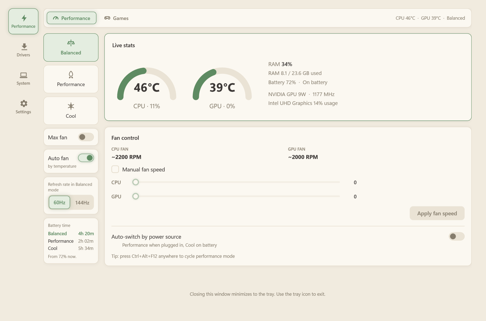
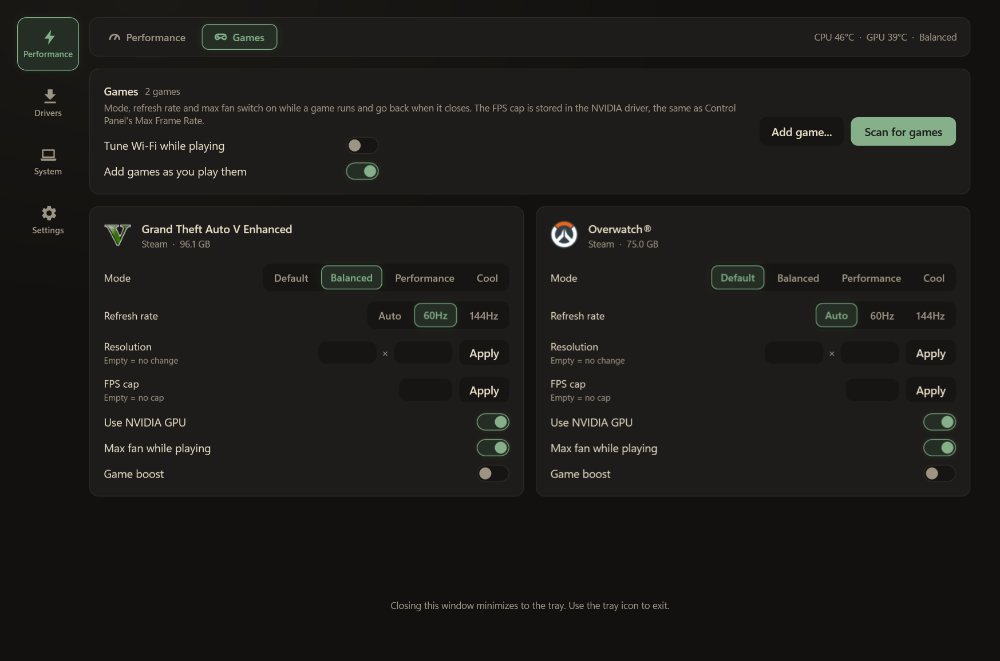
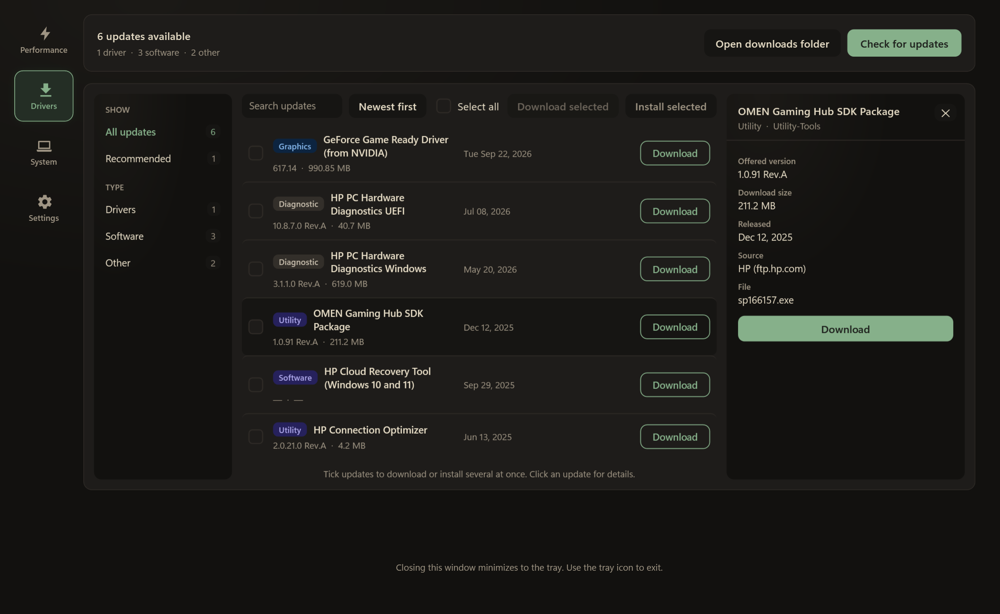
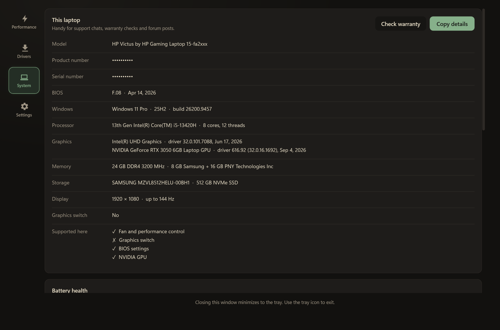
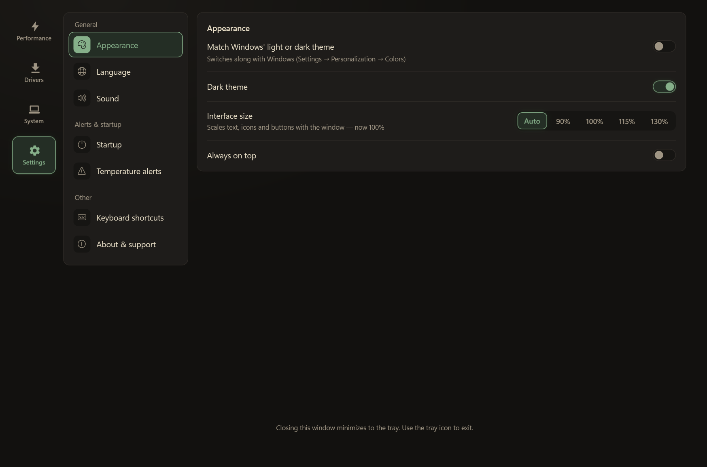

# Victus Hub

**English** · [العربية](README.ar.md)

Victus Hub (formerly HP Victus Control) is a tiny, low-overhead replacement for the fan and performance parts of Omen Gaming Hub, built
for an HP Victus 15. It should also work on Omen laptops with the same BIOS interface.

It talks directly to the same BIOS WMI provider (`root\wmi`, class `hpqBIntM`) that HP's own
software uses. No kernel driver, no background service, no telemetry: just a WPF app with a
tray icon that polls the BIOS every 2 seconds.

**[Download the latest release](https://github.com/9vsv6/victus-hub/releases/latest)**


## Screenshots

| | |
|---|---|
|  |  |
| **Performance** in the light theme | **Games**: a profile for each game |
|  |  |
| **Drivers**: updates from HP, NVIDIA and Intel | **System**: laptop details and what this model supports |
|  |  |
| **Settings** | **Arabic** interface, right to left |

## Features

- Live temperature and fan speed readout (tray tooltip and main window)
- Manual fan speed per fan (best-effort, see the note below)
- Force max fan speed
- GPU power: a higher power limit (custom TGP) and Dynamic Boost for the NVIDIA GPU, where the BIOS
  offers them
- Cool mode when idle: the fans quiet down after a few minutes without input and come back the
  moment you do. It leaves the selected mode, power plan and brightness alone and never kicks in
  during a game from your list
- Keyboard backlight switch, with an optional timeout that turns it off while the laptop sits idle
- Performance mode switch: Balanced / Performance / Cool, with the battery time each mode would
  give from the current charge. The times are learned from how much power each mode actually draws
  on battery
- Per-game profiles: performance mode, refresh rate, resolution, FPS cap, max fan, game boost
  (CPU priority, OneDrive paused) and which GPU the game runs on. They're applied when the game
  starts and put back when it closes. Optional Wi-Fi tuning (background scanning off) while any
  game runs
- Games are added to that list the first time they're played, straight from a Steam, Epic, Xbox,
  GOG or Battle.net library, with nothing switched on until you choose it
- Configurable global shortcuts for max fan and cycling the performance mode
- Keeps Windows' power plan in step with the selected mode
- Driver and BIOS updates from HP, NVIDIA and Intel:
  - Filters by type, search, sorting, and a details pane per update (offered vs installed version,
    size, source).
  - Entries for hardware this unit doesn't have are filtered out: wireless radios from other
    configurations, and SSD firmware for drives that aren't fitted or already run the offered
    revision.
  - A battery and charger safety check before BIOS installs.
  - Downloaded installers are cleaned up automatically.
- System page: laptop details, battery health, drive health (SSD temperature and remaining write
  endurance), BIOS graphics switch (where the model has one), fan test, shader cache cleanup
- BIOS settings without rebooting into setup: battery care, fans always on, action keys, boot menu
  delay, plus Restart into BIOS
- Checks its own GitHub releases once a day and can download and install a newer build in place,
  checking it against the release's SHA256 checksum first
- Installs itself: it offers to copy into Program Files with a Start menu shortcut and an entry in
  Windows' installed apps. Uninstalling from there puts the fans and power plan back to defaults
- Logs crashes to `%APPDATA%\HP Victus Control\crash.log` and says so on the next launch
- Detects what the laptop supports (fan control, graphics switch, BIOS settings, NVIDIA GPU),
  hides what it doesn't, and lists the result on the System page
- Light and dark themes, and an interface that scales with the window
- English or Arabic interface (Settings → Language). Arabic uses a right-to-left
  layout and the Alexandria typeface, with technical terms (CPU, GPU, RAM, BIOS…) kept in English

## Requirements

- Windows 10/11, x64
- [.NET 9 SDK](https://dotnet.microsoft.com/download/dotnet/9.0) to build (the release exe is
  self-contained and needs nothing installed)
- **Administrator** rights for the BIOS interface. The app asks for them itself (a UAC prompt)
  when you open it. "Start with Windows" gets them without a prompt, through a scheduled task

## Build & run

```powershell
dotnet build "HpVictusControl.sln" -c Release
dotnet run --project "src\HpVictusControl\HpVictusControl.csproj"
```

Or open `HpVictusControl.sln` in Visual Studio and hit Run. The app relaunches itself as
administrator, so Windows shows a UAC prompt. To debug, run Visual Studio as administrator so the
app doesn't hand off to a separate process.

## Releases

Pushing a `v*` tag builds the release on GitHub Actions. Each release has three files: the exe, its
SHA256 checksum, and `winget-manifests.zip`. That zip is ready to submit to
[microsoft/winget-pkgs](https://github.com/microsoft/winget-pkgs), which needs the repository to be
public. The exe is signed when the repository has two secrets: `SIGNING_CERT_PFX` (the base64 of a
code-signing `.pfx`) and `SIGNING_CERT_PASSWORD`. Without them the release is built unsigned.

## How it works

HP does not publish this interface. The command layout used here (command codes, data
structure, and the `hpqBIntM`/`hpqBDataIn` WMI classes) matches what the community has
reverse-engineered and documented. The main reference is the [OmenMon](https://github.com/OmenMon/OmenMon)
project, which this app used to learn which BIOS command bytes correspond to which function. The
BIOS/WMI calls used here are separate from OmenMon and much narrower in scope: no keyboard
colors, no CPU power tables and no direct Embedded Controller access. The app only uses fan level,
max fan, performance mode, GPU power (custom TGP and Dynamic Boost), the keyboard backlight's on/off
switch, and the single BIOS temperature sensor.

**Fan level unit**: the BIOS reports and accepts fan speed as a single byte per fan. Empirically
this tracks roughly "hundreds of RPM" (for example, a value of 45 ≈ 4500 RPM). The app displays it
that way, but treat it as approximate since HP hasn't documented the exact scale.

**Manual fan speed caveat**: setting a fan level is a direct, best-effort BIOS call. On some
BIOS versions the firmware's own automatic thermal curve overrides a manual value again after a
few seconds. There's no publicly documented way from WMI alone to durably disable that loop.
Doing so requires talking to the Embedded Controller directly through a kernel driver, which this
project intentionally avoids for simplicity and safety. If manual speed doesn't stick on your
model, "Force max fan speed" and the performance-mode switch are the reliable controls.

**FPS cap**: this app doesn't enforce the per-game frame limit itself. It writes the limit into
the NVIDIA driver's own profile database through `nvapi64.dll`: setting `0x10835002`, the same
"Max Frame Rate" that NVIDIA Control Panel writes. The driver then does the limiting, and the cap
stays in effect whether or not this app is running. It only applies to games rendering on the
NVIDIA GPU. The setting id is read back from the driver via `NvAPI_DRS_EnumAvailableSettingIds`
rather than hard-coded on faith. Measured on an RTX 3050 laptop GPU, an uncapped 1900 fps test
render drops to exactly 30.0 fps at a 30 fps cap.

**No "current mode" readout**: the BIOS interface can *set* the performance mode but can't read
back which one is active. So the mode selector can't reflect the laptop's actual state if something
else changed the mode.

## License

```
Copyright 2026 9vsv6

Licensed under the MIT License (the "License"). You may use, copy, modify,
merge, publish, distribute, sublicense and/or sell copies of this software,
provided the copyright notice and the License are included with it.
You may obtain a copy of the License in the LICENSE file or at

    https://opensource.org/licenses/MIT

The software is provided "AS IS", WITHOUT WARRANTY OF ANY KIND, express or
implied. See the License for the specific language governing permissions
and limitations under the License.
```

The bundled Alexandria typeface used for the Arabic interface is under the SIL Open Font License
([src/HpVictusControl/Fonts/OFL.txt](src/HpVictusControl/Fonts/OFL.txt)).

## Disclaimer

This app changes firmware-level hardware behavior through an undocumented interface, on a
best-effort basis. It's provided as-is, with no warranty. Use it at your own risk.
